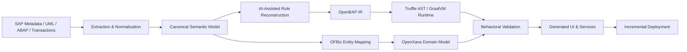

# OpenBAP & The Enterprise GraalVM Engine

> **Next-generation, AI-native business semantics and low-code UI on the JVM.**
> Decouple legacy enterprise logic, reconstruct business semantics, execute embedded ABAP through GraalVM/Truffle, and generate modern enterprise interfaces with OpenXava and AI.

---

## Table of Contents

- [Executive Overview](#executive-overview)
- [Architecture Goals](#architecture-goals)
- [Core Architectural Pillars](#core-architectural-pillars)
- [Reference Migration Flow](#reference-migration-flow)
- [System Architecture](#system-architecture)
- [Engineering Documentation](#engineering-documentation)
- [Stack Comparison](#stack-comparison)
- [Getting Started](#getting-started)
- [License](#license)

## Executive Overview

**OpenBAP** is an open-source, polyglot business application platform built around **GraalVM**, **Truffle**, **Apache OFBiz**, and **OpenXava**. Its purpose is not to reproduce SAP's proprietary C-Kernel. Instead, OpenBAP reconstructs the reusable business model around open components:

- **Apache OFBiz Entity Engine** acts as the semantic enterprise data backbone and open DDIC-equivalent.
- **GraalVM/Truffle** provides the execution substrate for OpenBAP rules and legacy-language interoperability.
- **AI-assisted reverse engineering** reconstructs domain models, business rules, transactions, and UI intent from legacy metadata and source artifacts.
- **OpenXava** exposes reconstructed domain models as modern low-code web applications.
- **Validation pipelines** compare reconstructed behavior with source-system expectations before deployment.

The result is an architecture for progressive modernization: legacy ERP semantics can be extracted, mapped, reconstructed, validated, and migrated incrementally rather than requiring a proprietary application server clone.

## Architecture Goals

1. Preserve business semantics while reducing dependency on proprietary runtime infrastructure.
2. Separate data-model migration from executable business-rule reconstruction.
3. Use AI as an engineering accelerator while retaining deterministic validation gates.
4. Keep reconstructed rules portable through GraalVM/Truffle ASTs and JVM interoperability.
5. Produce modern OpenXava applications from a reusable semantic model.
6. Support coexistence with legacy systems during staged migration.

## Core Architectural Pillars

### 1. Semantic Data Backbone — Apache OFBiz

OpenBAP maps legacy ERP entities, domains, relationships, and transaction semantics into the **Apache OFBiz Entity Engine**. SAP objects such as `MARA`, `BSEG`, and `KNA1` can be associated with canonical OFBiz concepts such as `Product`, `AcctgTrans`, and `Party`, while preserving traceability to the source model.

### 2. AI-Assisted Reverse Engineering

AI agents analyze exported metadata, UML models, ABAP sources, transaction definitions, validation rules, and UI descriptors. Their output is treated as a proposed semantic reconstruction rather than an unquestioned translation. Every generated artifact remains traceable to its legacy source and is subject to automated and human validation.

### 3. GraalVM / Truffle Execution

Reconstructed business rules are compiled into a compact OpenBAP representation and lowered to **Truffle AST nodes**. Partial evaluation and GraalVM JIT compilation provide an execution path for modernized rules while preserving polyglot interoperability with Java and other GraalVM languages.

### 4. Embedded Legacy ABAP

Where immediate replacement is not practical, OpenBAP can preserve selected ABAP logic through a `TruffleABAP` compatibility layer. This allows staged modernization instead of requiring a big-bang rewrite.

```text
fn process_legacy_ledger():
    #abap {
      DATA: lt_mara TYPE TABLE OF mara.
      SELECT * FROM mara INTO TABLE @lt_mara WHERE matnr = '1000'.
    }
```

### 5. AI-Augmented Low-Code UI — OpenXava

OpenXava consumes reconstructed domain models and JPA mappings. AI-assisted generators can propose annotations, list/detail views, validation messages, navigation flows, and role-oriented layouts, while application behavior remains driven by the validated semantic model.

## Reference Migration Flow



## System Architecture

```text
┌──────────────────────────────────────────────────────────────────────────────┐
│                     OpenXava Presentation Layer                              │
│          AI-assisted views, actions, dashboards and workflows               │
└───────────────────────────────────┬──────────────────────────────────────────┘
                                    │
                                    ▼
┌──────────────────────────────────────────────────────────────────────────────┐
│                     OpenBAP Semantic Application Layer                       │
│  Canonical model │ rule IR │ validations │ traceability │ migration maps    │
└──────────────────────────────┬──────────────────────────────┬────────────────┘
                               │                              │
                               ▼                              ▼
┌─────────────────────────────────────────┐   ┌───────────────────────────────┐
│ GraalVM / Truffle Runtime               │   │ Apache OFBiz Entity Engine    │
│ OpenBAP rules + optional TruffleABAP    │   │ Semantic DDIC / ERP entities  │
└──────────────────────┬──────────────────┘   └───────────────┬───────────────┘
                       │                                      │
                       └──────────────────┬───────────────────┘
                                          ▼
                           ┌────────────────────────────┐
                           │ Databases / APIs / Legacy │
                           │ coexistence integrations   │
                           └────────────────────────────┘
```

## Engineering Documentation

The repository now separates the product overview from the detailed engineering flow:

- [`docs/architecture/openbap-reference-architecture.md`](docs/architecture/openbap-reference-architecture.md) — components, semantic layers, traceability, runtime boundaries, validation, and deployment model.
- [`docs/workflows/sap-migration.md`](docs/workflows/sap-migration.md) — end-to-end legacy ERP extraction and migration workflow.
- [`docs/workflows/data-model-mapping.md`](docs/workflows/data-model-mapping.md) — SAP-to-OFBiz semantic mapping and reconciliation.
- [`docs/workflows/business-rule-reconstruction.md`](docs/workflows/business-rule-reconstruction.md) — AI-assisted rule recovery, OpenBAP IR, and Truffle lowering.
- [`docs/workflows/ui-reconstruction.md`](docs/workflows/ui-reconstruction.md) — UI intent extraction and OpenXava generation.
- [`docs/workflows/testing-and-deployment.md`](docs/workflows/testing-and-deployment.md) — differential testing, verification gates, rollout, and coexistence.

## Stack Comparison

| Capability | Legacy Enterprise Stack | OpenBAP Target Architecture |
|---|---|---|
| UI / low-code layer | SAP GUI / Fiori / proprietary generators | OpenXava + AI-assisted generation |
| Runtime kernel | Proprietary ABAP application server | GraalVM / Truffle |
| Data dictionary | Proprietary DDIC | Apache OFBiz Entity Engine + canonical semantic model |
| Business logic | Legacy procedural code | OpenBAP rules + selective embedded ABAP |
| Reverse engineering | Manual analysis / vendor-specific tooling | AI-assisted extraction with traceability and validation |
| Interoperability | Vendor APIs and adapters | JVM + GraalVM polyglot + open APIs |
| Migration model | Replacement or vendor upgrade | Incremental reconstruction and coexistence |

## Getting Started

### Prerequisites

- **GraalVM JDK 21+** with Truffle framework support.
- **Apache OFBiz 18.12+** configured as the entity provider.
- **OpenXava 7+** for generated enterprise UI.
- A source-artifact export pipeline for metadata, models, code, and transaction definitions.

### Conceptual Execution

```bash
# Example target CLI; implementation status may vary by module.
openbap --model model/openbap-domain.yaml \
        --rules rules/ \
        --ui openxava \
        --ofbiz-config config/ofbiz-containers.xml
```

## License

This project is licensed under the Apache 2.0 License. OpenBAP is an independent open-source project and is not affiliated with or endorsed by SAP SE, OpenXava, Apache OFBiz, Oracle, or Artech/GeneXus.
