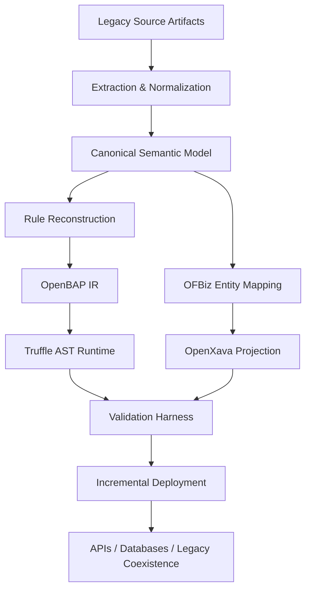

# OpenBAP Reference Architecture

## Purpose

OpenBAP modernizes legacy ERP applications by reconstructing business semantics rather than cloning proprietary runtime infrastructure. The architecture separates extraction, semantic normalization, rule reconstruction, execution, UI generation, verification, and deployment into explicit engineering stages.

## Architectural Principles

- **Semantic-first modernization:** preserve meaning before translating implementation.
- **Traceability:** every generated entity, rule, field, action, and test should point back to a source artifact.
- **AI with deterministic gates:** AI proposes mappings and implementations; schema checks, tests, reviewers, and acceptance criteria decide whether they progress.
- **Incremental coexistence:** modernized services can run beside legacy systems while migration proceeds bounded-context by bounded-context.
- **Open runtime:** Apache OFBiz, GraalVM/Truffle, JVM APIs, and OpenXava provide replaceable open integration points.

## Logical Layers

### 1. Source Acquisition

Inputs may include SAP DDIC exports, ABAP repositories, transport metadata, transaction codes, authorization information, screen definitions, interface contracts, database extracts, and reverse-engineered UML models.

Each artifact receives a stable source identifier so later generated artifacts can carry provenance metadata.

### 2. Extraction and Normalization

Parsers convert heterogeneous source artifacts into normalized records:

- entities, fields, domains, keys, relationships;
- programs, includes, forms, methods, exits, BAdIs and function modules;
- transactions and screen flows;
- validation and authorization constraints;
- external interfaces and batch jobs.

Normalization removes syntax-specific noise while retaining source references.

### 3. Canonical Semantic Model

The canonical model is the migration contract between legacy extraction and target generation. It describes:

- domain entities and value objects;
- relationships and aggregate boundaries;
- commands, queries, events and validations;
- business-rule dependencies;
- transaction and UI intent;
- authorization requirements;
- source-to-target traceability.

A serialized representation such as YAML or JSON can be used as the version-controlled intermediate artifact.

### 4. OFBiz Semantic Backbone

Legacy DDIC structures are mapped to Apache OFBiz entities. Mappings may be:

1. **Direct** — a source object corresponds closely to an OFBiz entity.
2. **Composite** — multiple source tables map to one target aggregate.
3. **Split** — one source structure maps to several target concepts.
4. **Extension** — OFBiz is extended with project-specific entities when no canonical match exists.

Every mapping should declare transformation rules, key strategy, nullability, cardinality, source ownership, and confidence/review state.

### 5. Business-Rule Reconstruction

ABAP and associated metadata are transformed into a dependency graph before code generation. AI-assisted reconstruction proposes intent-oriented rules and OpenBAP intermediate representation (IR). The IR is then lowered into Truffle AST nodes.

The recommended pipeline is:

```text
ABAP + metadata
      ↓
control/data-flow extraction
      ↓
semantic dependency graph
      ↓
AI-assisted intent reconstruction
      ↓
OpenBAP IR
      ↓
Truffle AST
      ↓
GraalVM partial evaluation / JIT
```

Selected source logic can remain executable through a `TruffleABAP` compatibility layer where replacement risk is too high.

### 6. OpenXava Application Generation

The validated semantic model is projected into JPA/OpenXava models. Generated assets can include:

- entity classes and relationships;
- list/detail views;
- validation annotations;
- actions and controllers;
- navigation and workflow hints;
- role-aware layouts;
- service/API bindings.

Generated UI is treated as a projection of the domain model, not as the authoritative source of business behavior.

### 7. Verification and Validation

OpenBAP should use layered validation:

- schema and mapping validation;
- unit tests for reconstructed rules;
- golden-master tests from known legacy inputs/outputs;
- differential execution between source and reconstructed implementations;
- data reconciliation for migrated entities;
- UI workflow acceptance tests;
- performance regression checks;
- security and authorization verification.

A migration unit should not advance to production until its required gates are satisfied.

### 8. Deployment and Coexistence

Deployment can proceed by bounded context, transaction family, or business capability. Anti-corruption adapters can keep source SAP integrations available while selected capabilities move to OpenBAP.

Typical stages:

```text
observe → shadow → dual-run → partial cutover → primary → legacy retirement
```

## Runtime Boundaries



## Traceability Model

Each generated artifact should include at minimum:

- source artifact ID;
- source revision or export timestamp;
- target artifact ID;
- transformation or generator version;
- confidence/review status for AI-derived mappings;
- test evidence identifiers;
- migration status.

This makes AI-assisted modernization auditable and repeatable.

## Non-Goals

OpenBAP does not require reproducing SAP's proprietary C-Kernel, binary-compatible application server behavior, or proprietary UI runtimes. Its target is semantic and behavioral preservation at the business-capability boundary using open components.
