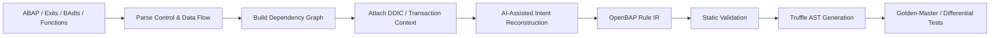

# Business Rule Reconstruction Workflow

## Objective

Recover business intent from ABAP and surrounding metadata, express it in a reviewable OpenBAP intermediate representation, and lower validated rules into Truffle ASTs.

## Workflow



## Reconstruction Stages

1. Parse source syntax without discarding source locations.
2. Extract reads, writes, calls, branches, loops, exceptions, database operations, and external effects.
3. Link symbols to normalized DDIC/domain entities.
4. Build a dependency graph that separates pure calculations from stateful and integration behavior.
5. Generate an intent-oriented rule proposal with explicit preconditions, inputs, outputs, side effects, and invariants.
6. Serialize the result as OpenBAP IR.
7. Apply static checks for unresolved symbols, type mismatches, unsupported side effects, recursion boundaries, and missing mappings.
8. Lower accepted IR nodes into Truffle AST nodes.
9. Validate against representative legacy executions.

## Example Intent Form

```text
rule ApplyRegionalDiscount
  when customer.country == "PE"
   and customer.totalOrders > 10
  then invoice.discountPercent = 15
```

The intent representation is not accepted solely because it was generated by AI. It must remain linked to source evidence and executable tests.

## Compatibility Path

Rules that are too risky or costly to reconstruct immediately may retain a bounded `TruffleABAP` implementation. These compatibility islands should expose stable interfaces so they can be replaced incrementally later.

## Acceptance Criteria

- all critical source dependencies are represented;
- generated intent is traceable to source artifacts;
- unsupported constructs are explicitly flagged rather than silently dropped;
- test vectors cover normal, boundary, and error behavior;
- differential results satisfy the approved behavioral baseline.
