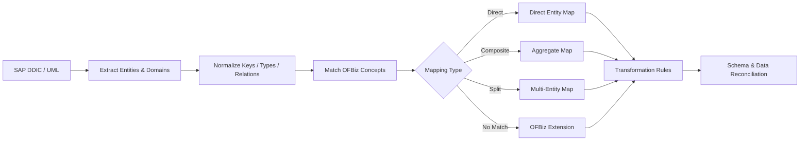

# Data Model Mapping Workflow

## Objective

Map SAP DDIC semantics into Apache OFBiz while preserving traceability, constraints, relationships, and migration intent.

## Workflow

## Mapping Record

Each mapping should capture:

- source table/entity and field identifiers;
- target OFBiz entity and field identifiers;
- mapping type: direct, composite, split, or extension;
- source and target data types;
- key and foreign-key strategy;
- cardinality and nullability;
- units, currencies, code lists, and domain conversions;
- transformation expressions;
- ownership and system-of-record designation;
- source provenance and review status.

## AI-Assisted Matching

AI can propose semantic matches using names, DDIC descriptions, UML relationships, usage patterns, ABAP access paths, and transaction context. Proposals should carry confidence metadata and must be validated against structural constraints and representative data.

## Validation

The mapping pipeline should verify:

1. referential integrity;
2. key uniqueness;
3. field-level transformation correctness;
4. aggregate totals and business invariants;
5. enum/domain coverage;
6. round-trip or reconciliation samples where applicable;
7. unmapped fields and orphan target fields.

## Deliverable

A version-controlled mapping manifest becomes the contract used by migration jobs, rule reconstruction, UI generation, and reconciliation tests.
