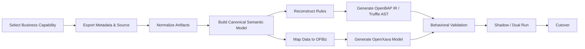

# SAP Migration Workflow

## Objective

Define the end-to-end engineering flow for moving a bounded legacy SAP capability into OpenBAP without cloning the proprietary application server.

## Workflow

## Stages

1. **Scope the capability.** Identify transactions, tables, programs, users, integrations, jobs, reports, and authorization objects inside the migration boundary.
2. **Acquire source artifacts.** Export metadata, ABAP, transport information, UML/reverse-engineered models, sample datasets, interface contracts, and known business test cases.
3. **Normalize.** Convert inputs into versioned machine-readable records with stable source identifiers.
4. **Model semantics.** Build entities, relationships, commands, queries, validations, rules, events, and UI intent in the canonical semantic model.
5. **Map the data model.** Reconcile SAP structures with OFBiz entities and explicitly model extensions.
6. **Reconstruct behavior.** Recover dependencies and business intent, then generate OpenBAP IR and Truffle nodes.
7. **Project the UI.** Generate OpenXava/JPA models and interaction flows from validated domain semantics.
8. **Validate.** Run schema, mapping, golden-master, differential, workflow, authorization, performance, and reconciliation tests.
9. **Deploy incrementally.** Use shadow and dual-run modes before controlled cutover.
10. **Retire legacy scope.** Remove the legacy path only after operational evidence and rollback criteria are satisfied.

## Required Outputs

- migration scope manifest;
- source-artifact inventory;
- canonical semantic model;
- SAP-to-OFBiz mapping manifest;
- rule dependency graph;
- OpenBAP IR and runtime artifacts;
- generated OpenXava application model;
- automated verification evidence;
- deployment and rollback plan.

## Acceptance Gate

A capability is ready for cutover only when source-to-target traceability is complete, critical behavior matches the approved baseline, migrated data reconciles within agreed tolerances, authorization tests pass, and rollback remains available.
