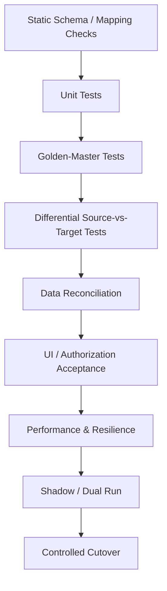

# Testing and Deployment Workflow

## Objective

Provide deterministic verification gates for AI-assisted reconstruction and define a low-risk path from development to coexistence and production cutover.

## Verification Pyramid

## Test Layers

### Static Validation

Check unresolved mappings, invalid types, broken references, unsupported constructs, duplicate target keys, and missing provenance.

### Unit and Property Tests

Exercise reconstructed business rules independently and validate declared invariants across normal and boundary inputs.

### Golden-Master Tests

Capture approved legacy input/output examples and execute the same cases against OpenBAP.

### Differential Testing

Where the legacy system remains available, execute equivalent transactions against source and target and compare observable business outcomes.

### Data Reconciliation

Compare record counts, keys, balances, aggregates, status distributions, currencies, units, and domain-specific invariants after transformation.

### UI and Authorization Acceptance

Verify workflows, required fields, navigation, roles, actions, validations, and error paths in generated OpenXava applications.

## Deployment Stages

1. **Development:** generated artifacts and tests are versioned together.
2. **Integration:** target components connect to representative external systems and migrated datasets.
3. **Shadow:** OpenBAP processes production-like events without becoming the system of record.
4. **Dual-run:** source and target execute the selected capability in parallel with reconciliation.
5. **Partial cutover:** selected users, transactions, or bounded contexts use OpenBAP as primary.
6. **Primary:** OpenBAP becomes authoritative for the migrated scope while rollback remains available.
7. **Retirement:** legacy implementation is removed only after the agreed stabilization period.

## Release Evidence

Each release candidate should retain:

- source and target revisions;
- semantic-model version;
- mapping-manifest version;
- generator/model versions used for AI-derived artifacts;
- test results and accepted deviations;
- migration/reconciliation reports;
- deployment configuration;
- rollback procedure.

## Stop Conditions

Deployment should halt on unexplained behavioral divergence, reconciliation failures above agreed tolerances, authorization regressions, data-integrity violations, or loss of source-to-target traceability.
